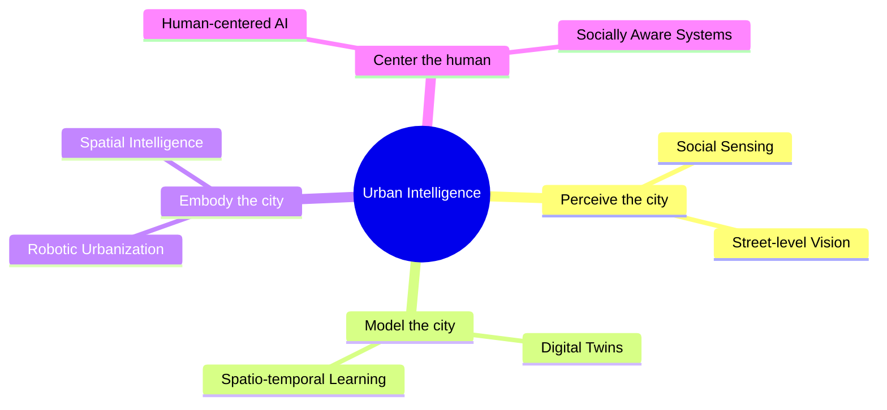

  

  

  
  
  
  
  

  <samp>“What is the city but the people?” · William Shakespeare, <i>Coriolanus</i></samp>

 

## 🎓 Education

|  | Degree | Institution | Years |
|:-:|:--|:--|:--|
| 🗽 | **Ph.D.** in Urban Science | New York University | 2026 – 2031 |
| 🤖 | **M.S.** in Artificial Intelligence | Carnegie Mellon University | 2025 – 2026 |
| 🏛️ | **B.Mgt.** in Information Systems | Tongji University | 2021 – 2025 |

## 🗺️ Research

  
  
  
  
  
  

  

